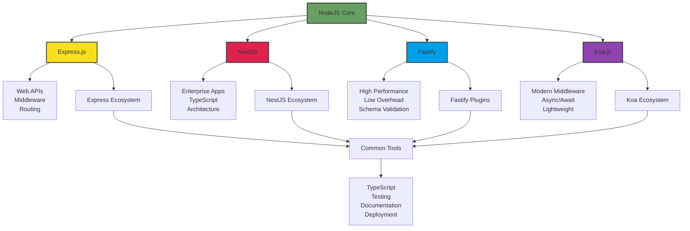

# NodeJS als Webserver-Umgebung

In diesem Abschnitt lernst du, wie NodeJS als Webserver-Umgebung im modernen Web-Ökosystem positioniert ist.

## Lernziele

- NodeJS im Web-Server-Kontext verstehen
- Vor- und Nachteile kennenlernen
- Vergleich mit anderen Technologien
- Einsatzgebiete identifizieren

## Grundlagen

### Was macht NodeJS als Webserver besonders?
- Event-driven, non-blocking I/O
- JavaScript auf Server- und Client-Seite
- Große Ökosystem-Bibliothek (npm)
- Einfache Skalierbarkeit

## Vergleich mit anderen Technologien

### Traditionelle Server
- PHP/Apache: Blockierend, pro Request ein Thread
- Java/Spring: Thread-basiert, schwergewichtig
- Python/Django: Blockierend, einfach zu lernen

### Moderne Alternativen
- Go: Kompiliert, sehr performant
- Rust: Systemnahe, sicher
- Deno: NodeJS-Nachfolger, moderner

### Vergleichstabelle

| Technologie | Kernstärken | Hauptherausforderungen | Beste Einsatzgebiete |
|------------|-------------|------------------------|---------------------|
| NodeJS | - Non-blocking I/O - JavaScript Full-Stack - Schnelle Entwicklung | - CPU-Last - Async-Komplexität | - APIs & Microservices - Echtzeit-Apps |
| PHP/Apache | - Einfachheit - Hosting-Verfügbarkeit | - Blocking I/O - Skalierung | - Webseiten - CMS |
| Java/Spring | - Enterprise-Features - Stabilität | - Hoher RAM-Verbrauch - Komplexität | - Enterprise-Systeme - Finanz-Apps |
| Python/Django | - Entwicklungsgeschwindigkeit - Data Science | - GIL-Bottleneck - I/O-Latenz | - Data-Backends - Prototypen |
| Go | - Native Threading - Deployment | - Ökosystem - Web-Fokus | - Cloud-Native - High-Perf APIs |
| Rust | - Zero-Cost Abstractions - Systemnähe | - Lernkurve - Entwicklungszeit | - Systemnahe Dienste - Safety-Critical |

## Stärken von NodeJS

### Vorteile
- Schnelle Entwicklung
- Große Community
- Viele verfügbare Pakete
- Einfache Skalierung
- Gute Performance für I/O-lastige Anwendungen

### Typische Einsatzgebiete
- REST APIs
- Echtzeit-Anwendungen
- Microservices
- Single Page Applications
- Streaming-Dienste

## Schwächen und Herausforderungen

### Nachteile
- CPU-intensive Tasks problematisch
- Callback-Hölle (ohne moderne Syntax)
- Asynchrone Fehlerbehandlung
- Memory Management

### Nicht ideal für
- CPU-intensive Berechnungen
- Traditionelle Datenbank-Operationen
- Schwergewichtige Backend-Systeme

## Ökosystem

### NodeJS Ökosystem-Visualisierung

### Beliebte Frameworks
- Express.js: Minimalistisch
- NestJS: Enterprise-ready
- Fastify: Performance-fokussiert
- Koa.js: Modern, Express-Nachfolger

### Tools und Utilities
- PM2: Process Manager
- Nginx: Reverse Proxy
- Docker: Containerisierung
- TypeScript: Typsicherheit

## Nächste Schritte

Nachdem du die Rolle von NodeJS als Webserver-Umgebung kennengelernt hast, kannst du mit dem [Events](../events/README.md) Modul fortfahren, um mehr über die Event-basierte Architektur zu lernen. 