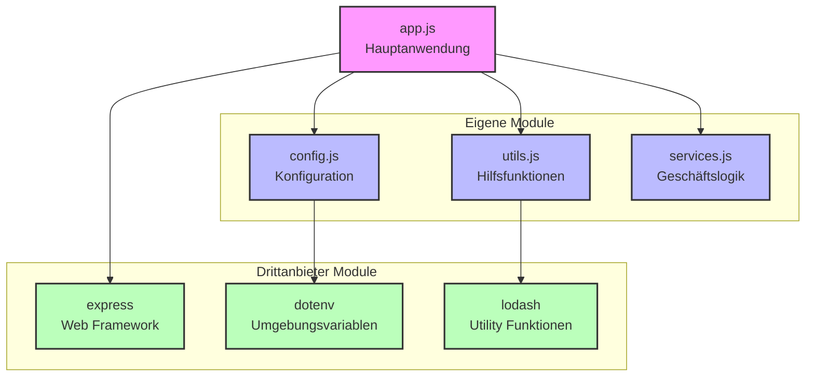

# Module System

In diesem Abschnitt lernst du die verschiedenen Möglichkeiten, Module in NodeJS zu importieren und zu exportieren. Module sind ein grundlegendes Konzept in NodeJS, das es ermöglicht, Code in separate Dateien aufzuteilen und wiederzuverwenden.

## Warum Module?

Module helfen uns dabei:
- Code zu organisieren
- Funktionalitäten zu kapseln
- Code wiederzuverwenden
- Wartbarkeit zu verbessern

## Einfaches Beispiel

Stellen wir uns vor, wir haben eine einfache Anwendung mit zwei Dateien:

### 1. Rechner-Funktionen (calculator.js)
```javascript
// Wir exportieren zwei einfache Funktionen
export const add = (a, b) => a + b;
export const subtract = (a, b) => a - b;

// Alternativ mit CommonJS:
// module.exports = {
//     add: (a, b) => a + b,
//     subtract: (a, b) => a - b
// };
```

### 2. Hauptprogramm (index.js)
```javascript
// Wir importieren die Funktionen aus calculator.js
import { add, subtract } from './calculator.js';

// Jetzt können wir die Funktionen verwenden
console.log(add(5, 3));      // Ausgabe: 8
console.log(subtract(5, 3)); // Ausgabe: 2

// Alternativ mit CommonJS:
// const { add, subtract } = require('./calculator');
```

## Die zwei Module-Systeme

NodeJS unterstützt zwei verschiedene Module-Systeme:

### 1. ES Modules (neu)
- Verwendet `import` und `export`
- Moderner Standard
- Besser für Browser-Kompatibilität
- Erfordert `.js`-Endung bei Imports

```javascript
// Exportieren
export const funktion = () => {};
export default class MeineKlasse {}

// Importieren
import { funktion } from './modul.js';
import MeineKlasse from './modul.js';
```

### 2. CommonJS (traditionell)
- Verwendet `require` und `module.exports`
- Älteres System
- Einfacher zu verwenden
- Keine Dateiendung notwendig

```javascript
// Exportieren
module.exports = { funktion: () => {} };

// Importieren
const modul = require('./modul');
```

## Wichtige Unterschiede

| ES Modules | CommonJS |
|------------|----------|
| Asynchrones Laden | Synchrones Laden |
| Statische Imports | Dynamische Imports |
| `.js`-Endung nötig | Keine Endung nötig |
| Kein `__dirname` | `__dirname` verfügbar |

## Best Practices

1. **Konsistenz**: Entscheide dich für ein System und bleibe dabei
2. **Klare Namen**: Benenne deine Exports verständlich
3. **Struktur**: Organisiere deine Module logisch
4. **Dokumentation**: Beschreibe, was dein Modul macht

## Drittanbieter-Pakete

Wie wir im Diagramm sehen können, nutzen Node.js-Anwendungen nicht nur eigene Module, sondern auch Pakete von Drittanbietern. Diese Pakete sind im Grunde nichts anderes als vorgefertigte Module, die wir in unserem Projekt verwenden können.

### Wie funktioniert das?

1. **Installation**: Pakete werden über npm (Node Package Manager) installiert
   ```bash
   npm install chalk
   ```

2. **Import**: Wir importieren das Paket mit der ES6-Import-Syntax
   ```javascript
   import chalk from 'chalk';
   ```

3. **Verwendung**: Die Pakete bieten vorgefertigte Funktionalitäten
   ```javascript
   // Einfache farbige Konsolenausgaben
   console.log(chalk.blue('Dieser Text ist blau'));
   console.log(chalk.red.bold('Dieser Text ist rot und fett'));
   console.log(chalk.green('Erfolg!') + ' ' + chalk.yellow('Warnung!'));
   ```

### Vorteile von Drittanbieter-Paketen

- **Zeitersparnis**: Wir müssen nicht alles selbst programmieren
- **Getestet**: Viele Pakete sind gut getestet und in Produktion bewährt
- **Wartung**: Updates und Sicherheitspatches werden regelmäßig bereitgestellt
- **Community**: Große Community für Support und Dokumentation

### Wichtige Hinweise

- Achte auf die Lizenz der Pakete
- Halte Pakete regelmäßig aktuell
- Prüfe die Popularität und Wartung der Pakete
- Vermeide zu viele Abhängigkeiten

## Anwendungsstruktur

Hier siehst du ein Beispiel, wie eine typische Node.js-Anwendung mit eigenen und Drittanbieter-Modulen strukturiert sein kann:



In diesem Diagramm siehst du:
- Die Hauptanwendung (`app.js`) als zentralen Einstiegspunkt
- Eigene Module für spezifische Funktionalitäten
- Drittanbieter-Module für allgemeine Aufgaben
- Die Beziehungen zwischen den Modulen

