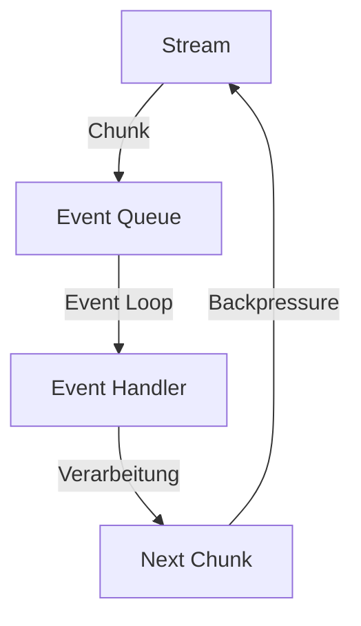

# Buffer und Streaming in NodeJS

In diesem Abschnitt lernst du die effiziente Arbeit mit Buffern und Streams in NodeJS kennen. Diese Konzepte sind fundamental für die effiziente Verarbeitung von Daten in NodeJS.

## Lernziele

- Buffer-Konzepte verstehen
- Readable und Writable Streams nutzen
- Transform Streams implementieren
- Best Practices für Streaming

## Grundlagen: Buffer und Streams

### Was sind Streams?

Streams sind eine grundlegende Abstraktion in NodeJS für die Verarbeitung von Daten. Anstatt eine gesamte Datei oder einen großen Datensatz auf einmal in den Speicher zu laden, verarbeiten Streams die Daten in kleinen Stücken (Chunks). Dies ist besonders wichtig für:

- Große Dateien
- Echtzeit-Daten
- Netzwerk-Kommunikation
- Datenverarbeitung

### Wie funktionieren Streams?

1. **Chunk-basierte Verarbeitung**:
   - Daten werden in kleine Stücke aufgeteilt
   - Jeder Chunk wird einzeln verarbeitet
   - Speichereffizient und performant

2. **Event-basierte Architektur**:
   - Streams emittieren Events
   - Event Loop verarbeitet diese asynchron
   - Non-blocking I/O Operationen

3. **Backpressure-Mechanismus**:
   - Verhindert Speicherüberlauf
   - Reguliert Datenfluss
   - Automatische Pufferung

### Streams und der Event Loop



## Buffer: Die Grundlage für Streams

### Buffer erstellen
```javascript
import { Buffer } from 'buffer';

// Buffer mit fester Größe
const buf1 = Buffer.alloc(10);

// Buffer mit Inhalt
const buf2 = Buffer.from('Hallo Welt');

// Buffer aus Array
const buf3 = Buffer.from([1, 2, 3, 4, 5]);
```

### Buffer Operationen
```javascript
import { Buffer } from 'buffer';

const buf = Buffer.from('Hallo Welt');

// Lesen
console.log(buf.toString()); // 'Hallo Welt'
console.log(buf.toString('hex')); // Hexadezimal

// Schreiben
buf.write('Neuer Text');
console.log(buf.toString());

// Kopieren
const buf2 = Buffer.alloc(10);
buf.copy(buf2);
```

## Stream-Typen und ihre Anwendung

### Readable Streams

Readable Streams sind die Quelle der Daten. Sie werden verwendet, um Daten zu lesen, wie zum Beispiel aus Dateien oder Netzwerkverbindungen.

```javascript
import { createReadStream } from 'fs';

const readStream = createReadStream('grosse-datei.txt', {
    encoding: 'utf8',
    highWaterMark: 64 * 1024 // 64KB Chunks
});

readStream.on('data', (chunk) => {
    console.log('Chunk gelesen:', chunk.length);
});

readStream.on('end', () => {
    console.log('Datei komplett gelesen');
});

readStream.on('error', (err) => {
    console.error('Fehler beim Lesen:', err);
});
```

### Writable Streams

Writable Streams sind das Ziel der Daten. Sie werden verwendet, um Daten zu schreiben, wie zum Beispiel in Dateien oder Netzwerkverbindungen.

```javascript
import { createWriteStream } from 'fs';

const writeStream = createWriteStream('output.txt', {
    encoding: 'utf8',
    flags: 'a' // Anhängen
});

writeStream.write('Erste Zeile\n');
writeStream.write('Zweite Zeile\n');

writeStream.end(() => {
    console.log('Schreiben abgeschlossen');
});
```

### Transform Streams

Transform Streams ermöglichen die Verarbeitung und Umwandlung von Daten während des Streams. Sie sind besonders nützlich für Datenkonvertierungen und -transformationen.

```javascript
import { Transform } from 'stream';

class UpperCaseTransform extends Transform {
    _transform(chunk, encoding, callback) {
        const upperChunk = chunk.toString().toUpperCase();
        this.push(upperChunk);
        callback();
    }
}

const upperCase = new UpperCaseTransform();
```

## Praktische Anwendungsfälle

### 1. Dateiverarbeitung
- Große Log-Dateien analysieren
- Dateien komprimieren/dekomprimieren
- Daten konvertieren (z.B. JSON zu CSV)

### 2. Netzwerk-Kommunikation
- HTTP-Requests/Responses
- WebSocket-Verbindungen
- TCP/UDP Kommunikation

### 3. Echtzeit-Daten
- Sensordaten verarbeiten
- Live-Streaming
- Chat-Anwendungen

### 4. Datenbank-Operationen
- Große Datensätze importieren
- Datenbank-Backups
- Replikation

## Best Practices

### Performance
- Angemessene Chunk-Größen wählen
- Backpressure berücksichtigen
- Memory Leaks vermeiden
- Streams korrekt schließen

### Fehlerbehandlung
- Error-Events abfangen
- Try-Catch für synchrone Operationen
- Fehler propagieren
- Ressourcen aufräumen

### Code-Organisation
- Streams modular aufbauen
- Wiederverwendbare Transform Streams
- Klare Event-Handler
- Dokumentation der Stream-API

## Nächste Schritte

Nachdem du die Konzepte von Buffer und Streaming kennengelernt hast, kannst du mit dem [Filesystem Promises](fsPromises.md) Modul fortfahren, um die moderne Promise-basierte API für Dateisystem-Operationen zu lernen. 