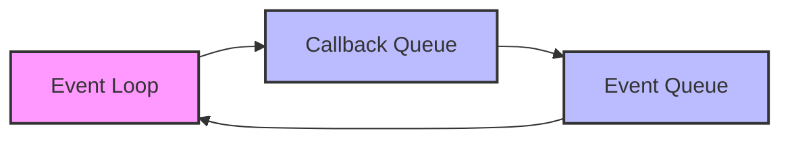
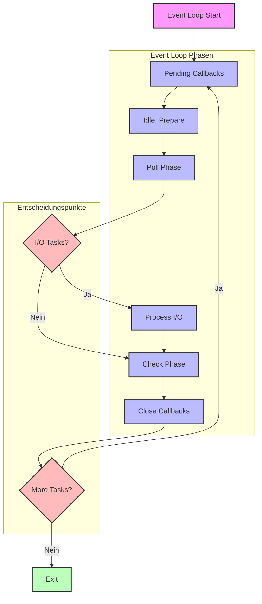

# Event Loop in NodeJS

In diesem Abschnitt lernst du die grundlegende Funktionsweise des Event Loops in NodeJS kennen.

## Lernziele

- Event Loop Konzept verstehen
- Callback-basierte asynchrone Programmierung
- Blockierende vs. nicht-blockierende Operationen
- Performance-Optimierung durch Event Loop Verständnis

## Grundkonzepte

### Was ist der Event Loop?
Der Event Loop ist das Herzstück der asynchronen Programmierung in NodeJS. Er ermöglicht es, mehrere Operationen gleichzeitig zu verarbeiten, ohne den Hauptthread zu blockieren. Dies ist besonders wichtig für I/O-intensive Anwendungen wie Web-Server.

- Herzstück der asynchronen Programmierung
- Ermöglicht nicht-blockierende I/O-Operationen
- Verwaltet Callback-Queue und Event-Queue
- Single-Threaded mit Event-basierter Architektur

### Event Loop Phasen
Der Event Loop durchläuft verschiedene Phasen, die jeweils spezifische Aufgaben erfüllen. Diese Phasen werden in einer bestimmten Reihenfolge ausgeführt und bilden einen Zyklus, der sich wiederholt, solange die NodeJS-Anwendung läuft.

1. Pending Callbacks (I/O Callbacks)
2. Idle, Prepare
3. Poll (I/O)
4. Check (setImmediate)
5. Close Callbacks
6. Timers (setTimeout, setInterval)

### Vereinfachte Event Loop Visualisierung



Diese vereinfachte Darstellung zeigt die grundlegende Struktur des Event Loops:
- Der Event Loop verarbeitet kontinuierlich Events
- Die Callback Queue enthält auszuführende Funktionen
- Die Event Queue sammelt neue Events

### Event Loop Visualisierung (Detailliert)



Das detaillierte Diagramm zeigt den vollständigen Ablauf des Event Loops mit Fokus auf I/O-Operationen:
- Start mit Pending Callbacks
- I/O-basierte Poll-Phase
- Verarbeitung von I/O-Tasks
- Entscheidungspunkte für weitere Tasks

## Event Loop Funktionsweise

### Grundprinzip mit Callbacks
Der Event Loop verarbeitet Callbacks in einer bestimmten Reihenfolge. Hier ein Beispiel mit I/O-Operationen:

```javascript
console.log('Start');

// I/O Operation mit Callback
fs.readFile('datei.txt', (err, data) => {
    console.log('Datei gelesen');
});

// Weitere I/O Operation
database.query('SELECT * FROM users', (err, results) => {
    console.log('Datenbankabfrage abgeschlossen');
});

console.log('Ende');
```

In diesem Beispiel sehen wir:
1. Synchroner Code wird zuerst ausgeführt
2. I/O-Operationen werden asynchron gestartet
3. Callbacks werden ausgeführt, sobald die Operationen abgeschlossen sind

### Callback-Beispiel
Hier ein praktisches Beispiel für die Verarbeitung mehrerer I/O-Operationen:

```javascript
// Datei lesen
fs.readFile('input.txt', (err, data) => {
    if (err) {
        console.error('Fehler beim Lesen:', err);
        return;
    }
    
    // Daten verarbeiten
    const processedData = data.toString().toUpperCase();
    
    // Verarbeitete Daten schreiben
    fs.writeFile('output.txt', processedData, (err) => {
        if (err) {
            console.error('Fehler beim Schreiben:', err);
            return;
        }
        console.log('Verarbeitung abgeschlossen');
    });
});
```

## Blockierende Operationen

### Problem
Blockierende Operationen können den Event Loop verlangsamen oder sogar zum Stillstand bringen. Hier ein Vergleich zwischen blockierenden und nicht-blockierenden Operationen:

```javascript
// Blockierend
const data = fs.readFileSync('grosse-datei.txt');
console.log('Datei gelesen');

// Nicht-blockierend
fs.readFile('grosse-datei.txt', (err, data) => {
    console.log('Datei gelesen');
});
console.log('Weiterer Code');
```

Der Unterschied ist entscheidend:
- Blockierende Operationen halten den Event Loop an
- Nicht-blockierende Operationen ermöglichen parallele Verarbeitung
- Der Event Loop kann während I/O-Operationen andere Tasks verarbeiten

### CPU-intensive Tasks
CPU-intensive Aufgaben können den Event Loop blockieren. Hier sind zwei Ansätze im Vergleich:

```javascript
// Blockiert den Event Loop
function blockierendeBerechnung() {
    let sum = 0;
    for (let i = 0; i < 1000000000; i++) {
        sum += i;
    }
    return sum;
}

// Besser: Task aufteilen
function nichtBlockierendeBerechnung() {
    let sum = 0;
    let i = 0;
    
    function berechneChunk() {
        for (let j = 0; j < 1000000; j++) {
            sum += i++;
        }
        if (i < 1000000000) {
            setImmediate(berechneChunk);
        }
    }
    
    berechneChunk();
}
```

Die nicht-blockierende Version:
- Teilt die Berechnung in kleinere Chunks
- Ermöglicht anderen Tasks die Ausführung
- Verhindert Event Loop Blockierung

## Event Loop Optimierung

### Callback-Prioritäten
Die Reihenfolge der Callback-Ausführung ist wichtig für die Performance:

```javascript
// I/O Callback
fs.readFile('datei.txt', (err, data) => {
    console.log('I/O Callback');
});

// Microtask (Promise)
Promise.resolve().then(() => {
    console.log('Microtask');
});

// Normale Callback
process.nextTick(() => {
    console.log('Next Tick');
});
```

Die Ausführungsreihenfolge ist:
1. process.nextTick()
2. Promises
3. I/O Callbacks
4. setImmediate()

## Best Practices

### Event Loop Performance
Um die Performance des Event Loops zu optimieren, sollten folgende Punkte beachtet werden:
- CPU-intensive Tasks aufteilen
- Blockierende Operationen vermeiden
- Unendliche Loops verhindern
- Memory Leaks vermeiden

### Code-Struktur
Eine gute Code-Struktur ist entscheidend für die Event Loop Performance:
- Asynchrone Operationen bevorzugen
- Callbacks effizient nutzen
- Event-Listener sauber aufräumen
- Ressourcen rechtzeitig freigeben

### Debugging
Effektives Debugging des Event Loops erfordert:
- Event Loop Blockierung erkennen
- Performance-Probleme identifizieren
- Memory-Usage überwachen
- Profiling-Tools nutzen