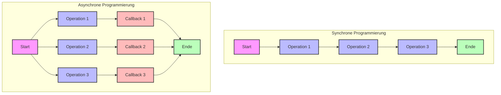

# Synchron vs. Asynchron in NodeJS

In diesem Abschnitt lernst du die grundlegenden Konzepte der synchronen und asynchronen Programmierung in NodeJS kennen.

## Lernziele

- Unterschied zwischen synchroner und asynchroner Programmierung verstehen
- Blockierende vs. nicht-blockierende Operationen kennenlernen
- Vorteile und Nachteile beider Ansätze verstehen
- Typische Anwendungsfälle identifizieren

## Grundkonzepte

### Synchrone Programmierung
- Ausführung erfolgt sequentiell
- Jede Operation blockiert bis zum Abschluss
- Einfacher zu verstehen und zu debuggen
- Kann zu Performance-Problemen führen

### Asynchrone Programmierung
- Nicht-blockierende Ausführung
- Parallele Verarbeitung möglich
- Effizientere Ressourcennutzung
- Komplexere Programmstruktur

## Vergleich

### Synchrone Operationen
```javascript
// Blockierend
const data = fs.readFileSync('datei.txt');
console.log(data);
console.log('Dies wird erst nach dem Lesen ausgeführt');
```

### Asynchrone Operationen
```javascript
// Nicht-blockierend
fs.readFile('datei.txt', (err, data) => {
    console.log(data);
});
console.log('Dies wird sofort ausgeführt');
```

## Typische Anwendungsfälle

### Synchron
- Einfache Skripte
- Konfigurationsdateien lesen
- Kleine Dateioperationen
- Berechnungsintensive Tasks

### Asynchron
- Web-Server
- Datenbank-Operationen
- Datei-Uploads/Downloads
- API-Aufrufe


### Visualisierung des Programmablaufs



Das Diagramm zeigt den grundlegenden Unterschied zwischen synchroner und asynchroner Programmierung:

**Synchrone Programmierung:**
- Operationen werden nacheinander ausgeführt
- Jede Operation muss abgeschlossen sein, bevor die nächste beginnt
- Klare, vorhersehbare Ausführungsreihenfolge

**Asynchrone Programmierung:**
- Operationen können parallel gestartet werden
- Callbacks werden ausgeführt, sobald die jeweilige Operation abgeschlossen ist
- Flexiblere, aber komplexere Ausführungsreihenfolge


## Vorteile und Nachteile

### Vergleichstabelle: Synchrone vs. Asynchrone Programmierung

| Aspekt | Synchrone Programmierung | Asynchrone Programmierung |
|--------|--------------------------|---------------------------|
| **Verständlichkeit** | ✅ Einfacher zu verstehen und zu debuggen | ❌ Komplexere Programmstruktur |
| **Ausführung** | ✅ Vorhersehbare, sequentielle Ausführung | ✅ Parallele Verarbeitung möglich |
| **Performance** | ❌ Blockierende Operationen | ✅ Bessere Performance bei I/O |
| **Ressourcennutzung** | ❌ Ineffiziente Ressourcennutzung | ✅ Effiziente Ressourcennutzung |
| **Skalierbarkeit** | ❌ Begrenzte Skalierbarkeit | ✅ Gute Skalierbarkeit |
| **Fehlerbehandlung** | ✅ Einfachere Fehlerbehandlung | ❌ Komplexere Fehlerbehandlung |
| **Debugging** | ✅ Einfacher zu debuggen | ❌ Schwierigeres Debugging |
| **Lernkurve** | ✅ Flache Lernkurve | ❌ Steilere Lernkurve |

### Anwendungsfälle im Vergleich

| Anwendungsfall | Synchrone Programmierung | Asynchrone Programmierung |
|----------------|--------------------------|---------------------------|
| **Web-Server** | ❌ Nicht geeignet | ✅ Ideal |
| **Datenbank-Operationen** | ❌ Nicht geeignet | ✅ Ideal |
| **Datei-Uploads** | ❌ Nicht geeignet | ✅ Ideal |
| **API-Aufrufe** | ❌ Nicht geeignet | ✅ Ideal |
| **Konfigurationsdateien** | ✅ Geeignet | ⚠️ Möglich, aber Overkill |
| **Kleine Dateioperationen** | ✅ Geeignet | ⚠️ Möglich, aber Overkill |
| **Berechnungsintensive Tasks** | ✅ Geeignet | ⚠️ Möglich, aber Overkill |
| **Einfache Skripte** | ✅ Geeignet | ⚠️ Möglich, aber Overkill |

### Performance-Aspekte

| Aspekt | Synchrone Programmierung | Asynchrone Programmierung |
|--------|--------------------------|---------------------------|
| **I/O-Operationen** | ❌ Blockiert den Event Loop | ✅ Nicht-blockierend |
| **CPU-Intensive Tasks** | ✅ Direkte Ausführung | ⚠️ Kann Event Loop blockieren |
| **Memory-Usage** | ✅ Vorhersehbar | ⚠️ Kann höher sein |
| **Response-Time** | ❌ Kann lang sein | ✅ Schnelle Initial-Response |
| **Parallelverarbeitung** | ❌ Nicht möglich | ✅ Effizient möglich |


## Best Practices

### Wann synchron?
- Einfache Skripte
- Kleine Dateioperationen
- Konfigurationsdateien
- Berechnungsintensive Tasks

### Wann asynchron?
- Web-Server
- Datenbank-Operationen
- Große Dateioperationen
- Netzwerk-Kommunikation

## Nächste Schritte

Nachdem du die Grundlagen der synchronen und asynchronen Programmierung kennengelernt hast, kannst du mit dem [Callbacks](callbacks.md) Modul fortfahren, um mehr über die traditionelle Callback-basierte asynchrone Programmierung zu lernen. 