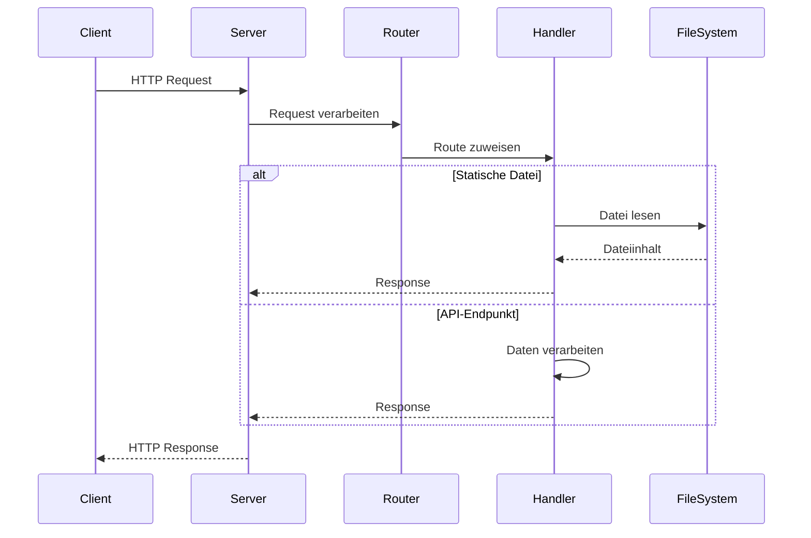

# HTTP Server in NodeJS

In diesem Abschnitt lernst du, wie man einen einfachen HTTP-Server mit NodeJS implementiert.

## Lernziele

- HTTP-Server erstellen
- Request/Response-Handling
- Routing implementieren
- Statische Dateien ausliefern

## HTTP-Methoden und Funktionalitäten

### Übersicht der HTTP-Methoden

| Methode | Beschreibung | Typische Verwendung |
|---------|--------------|---------------------|
| GET | Daten abrufen | Seitenaufruf, API-Abfragen |
| POST | Daten senden | Formulare, API-Daten |
| PUT | Ressource aktualisieren | API-Updates |
| DELETE | Ressource löschen | API-Löschoperationen |
| PATCH | Teilaktualisierung | API-Teilupdates |
| HEAD | Header abrufen | Status-Checks |
| OPTIONS | Verfügbare Optionen | CORS, API-Dokumentation |

### Wichtige HTTP-Header

Die HTTP-Header sind ein zentraler Bestandteil der HTTP-Kommunikation. Sie enthalten Metadaten über die Anfrage oder Antwort. Hier sind einige häufig verwendete Header als Beispiele:

| Header | Beschreibung | Beispiel |
|--------|--------------|----------|
| Content-Type | Art der Daten | text/html, application/json |
| Content-Length | Größe der Daten | 1024 |
| Location | Weiterleitung | /neue-seite |
| Set-Cookie | Cookie setzen | session=abc123 |
| Authorization | Authentifizierung | Bearer token123 |

Es gibt viele weitere Header, die je nach Anwendungsfall verwendet werden können. Die hier aufgeführten sind nur eine Auswahl der am häufigsten verwendeten Header.

## HTTP-Server Flow



## Grundlegender HTTP-Server

### Server erstellen
```javascript
import { createServer } from 'http';

const server = createServer((req, res) => {
    res.writeHead(200, { 'Content-Type': 'text/plain' });
    res.end('Hallo Welt!');
});

server.listen(3000, () => {
    console.log('Server läuft auf http://localhost:3000');
});
```

### Request-Handling
```javascript
import { createServer } from 'http';

const server = createServer((req, res) => {
    // Request-Methode und URL auslesen
    const { method, url } = req;
    
    // Einfaches Routing
    if (method === 'GET' && url === '/') {
        res.writeHead(200, { 'Content-Type': 'text/plain' });
        res.end('Willkommen auf der Startseite!');
    } else if (method === 'GET' && url === '/about') {
        res.writeHead(200, { 'Content-Type': 'text/plain' });
        res.end('Über uns');
    } else {
        res.writeHead(404, { 'Content-Type': 'text/plain' });
        res.end('404 - Seite nicht gefunden');
    }
});

server.listen(3000);
```

## Statische Dateien

### Dateien ausliefern
```javascript
import { createServer } from 'http';
import { readFile } from 'fs/promises';
import { join } from 'path';

const server = createServer(async (req, res) => {
    try {
        // Nur GET-Requests für statische Dateien
        if (req.method === 'GET') {
            const filePath = join(process.cwd(), 'public', req.url);
            const content = await readFile(filePath, 'utf8');
            
            // Content-Type basierend auf Dateiendung
            const ext = req.url.split('.').pop();
            const contentType = {
                'html': 'text/html',
                'css': 'text/css',
                'js': 'text/javascript',
                'json': 'application/json'
            }[ext] || 'text/plain';

            res.writeHead(200, { 'Content-Type': contentType });
            res.end(content);
        } else {
            res.writeHead(405, { 'Content-Type': 'text/plain' });
            res.end('Methode nicht erlaubt');
        }
    } catch (err) {
        res.writeHead(404, { 'Content-Type': 'text/plain' });
        res.end('Datei nicht gefunden');
    }
});

server.listen(3000);
```

## Request-Parameter

### Query-Parameter
```javascript
import { createServer } from 'http';
import { URL } from 'url';

const server = createServer((req, res) => {
    const { searchParams } = new URL(req.url, `http://${req.headers.host}`);
    
    // Parameter auslesen
    const name = searchParams.get('name') || 'Gast';
    
    res.writeHead(200, { 'Content-Type': 'text/plain' });
    res.end(`Hallo ${name}!`);
});

server.listen(3000);
```

### POST-Daten
```javascript
import { createServer } from 'http';

const server = createServer((req, res) => {
    if (req.method === 'POST') {
        let body = '';
        
        // Daten sammeln
        req.on('data', chunk => {
            body += chunk.toString();
        });
        
        // Verarbeitung nach vollständigem Empfang
        req.on('end', () => {
            try {
                const data = JSON.parse(body);
                res.writeHead(200, { 'Content-Type': 'application/json' });
                res.end(JSON.stringify({ received: data }));
            } catch (err) {
                res.writeHead(400, { 'Content-Type': 'text/plain' });
                res.end('Ungültige JSON-Daten');
            }
        });
    } else {
        res.writeHead(405, { 'Content-Type': 'text/plain' });
        res.end('Nur POST-Requests erlaubt');
    }
});

server.listen(3000);
```

## Best Practices

### Fehlerbehandlung
- Try-Catch für asynchrone Operationen
- Fehler-Responses definieren
- Logging implementieren
- Ressourcen aufräumen

### Performance
- Asynchrone Operationen nutzen
- Caching implementieren
- Gzip-Komprimierung
- Keep-Alive Verbindungen

### Sicherheit
- Input validieren
- Content-Type prüfen
- Größenbeschränkungen
- CORS-Header setzen

## Nächste Schritte

Nachdem du die Grundlagen des HTTP-Servers kennengelernt hast, kannst du mit dem [WebSocket Server](webSocketServer.md) Modul fortfahren, um Echtzeit-Kommunikation zu implementieren. 