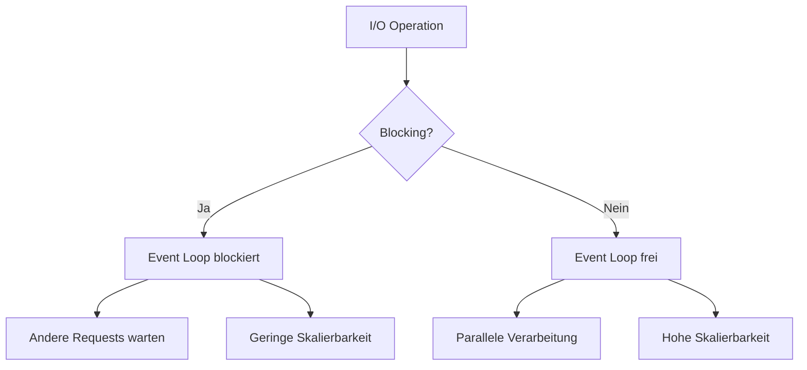
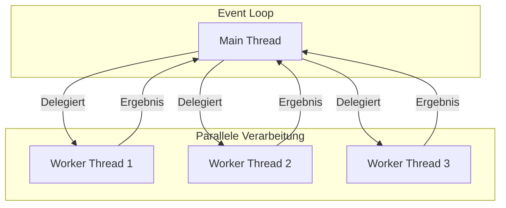

# Performance & Asynchrone Callbacks

In diesem Abschnitt lernst du, wie asynchrone Callbacks und der Event Loop die Performance von NodeJS Webservern beeinflussen.

## Event Loop und Performance

### Grundprinzip des Event Loops
```javascript
import express from 'express';

const app = express();

// Blockierende Operation blockiert den Event Loop
app.get('/blocking', (req, res) => {
    // Diese Operation blockiert den Event Loop
    let result = 0;
    for (let i = 0; i < 1000000000; i++) {
        result += i;
    }
    res.json({ result });
});

// Nicht-blockierende Operation nutzt den Event Loop
app.get('/non-blocking', (req, res) => {
    // Diese Operation wird asynchron ausgeführt
    setImmediate(() => {
        let result = 0;
        for (let i = 0; i < 1000000000; i++) {
            result += i;
        }
        res.json({ result });
    });
});
```

### Callback-Ketten und Performance
```javascript
import express from 'express';
import { readFile } from 'fs/promises';

const app = express();

// Ineffiziente Callback-Kette
app.get('/inefficient', (req, res) => {
    readFile('data1.json', 'utf8')
        .then(data1 => {
            return readFile('data2.json', 'utf8')
                .then(data2 => {
                    return readFile('data3.json', 'utf8')
                        .then(data3 => {
                            res.json({
                                data1: JSON.parse(data1),
                                data2: JSON.parse(data2),
                                data3: JSON.parse(data3)
                            });
                        });
                });
        });
});

// Effiziente parallele Ausführung
app.get('/efficient', async (req, res) => {
    try {
        const [data1, data2, data3] = await Promise.all([
            readFile('data1.json', 'utf8'),
            readFile('data2.json', 'utf8'),
            readFile('data3.json', 'utf8')
        ]);
        
        res.json({
            data1: JSON.parse(data1),
            data2: JSON.parse(data2),
            data3: JSON.parse(data3)
        });
    } catch (err) {
        res.status(500).json({ error: 'Fehler beim Lesen der Daten' });
    }
});
```

## I/O Operationen: Blocking vs. Non-Blocking

### Vergleichstabelle

| Aspekt | Blocking I/O | Non-Blocking I/O |
|--------|--------------|------------------|
| Ausführung | Synchron | Asynchron |
| Event Loop | Wird blockiert | Bleibt frei |
| Performance | Niedriger | Höher |
| Speichernutzung | Geringer | Höher |
| Code-Komplexität | Einfacher | Komplexer |
| Fehlerbehandlung | Try-Catch | Callbacks/Promises |
| Skalierbarkeit | Begrenzt | Hoch |

### Typische Anwendungsfälle

| Operation | Blocking | Non-Blocking |
|-----------|----------|--------------|
| Datei lesen | `fs.readFileSync()` | `fs.readFile()` |
| Datei schreiben | `fs.writeFileSync()` | `fs.writeFile()` |
| HTTP Request | `http.get()` (Callback) | `fetch()` (Promise) |
| Datenbank | Synchroner Treiber | Asynchroner Treiber |
| Netzwerk | `net.connect()` | `net.createConnection()` |

### Performance-Implikationen



### Best Practices für I/O Operationen

1. **Blocking I/O vermeiden**:
   - Synchronen Code nur für Start-up verwenden
   - Kritische Pfade asynchron halten
   - Worker Threads für CPU-intensive Tasks

2. **Non-Blocking I/O nutzen**:
   - Promises und async/await
   - Streams für große Datenmengen
   - Event-basierte Architektur

3. **Performance-Optimierungen**:
   - Caching implementieren
   - Batch-Operationen nutzen
   - Connection Pooling

## Best Practices

### Event Loop Optimierung
- Blockierende Operationen vermeiden
- CPU-intensive Tasks in Worker Threads auslagern
- Callback-Ketten optimieren
- Promise.all für parallele Operationen nutzen

### Asynchrone Programmierung
- Async/Await statt Callback-Hell
- Fehlerbehandlung in Promise-Ketten
- Ressourcen nach Verwendung freigeben
- Timeouts für asynchrone Operationen setzen

## Beispiel: Performance-optimierter Server

```javascript
import express from 'express';
import { Worker } from 'worker_threads';

const app = express();

// CPU-intensive Operation in Worker Thread
app.get('/compute', (req, res) => {
    const worker = new Worker('./compute-worker.js');
    
    worker.on('message', (result) => {
        res.json({ result });
    });
    
    worker.on('error', (err) => {
        res.status(500).json({ error: err.message });
    });
    
    worker.postMessage({ task: 'compute' });
});

// Asynchrone Operationen parallel ausführen
app.get('/parallel', async (req, res) => {
    try {
        const [result1, result2] = await Promise.all([
            asyncOperation1(),
            asyncOperation2()
        ]);
        
        res.json({ result1, result2 });
    } catch (err) {
        res.status(500).json({ error: err.message });
    }
});

// Nicht-blockierende Verarbeitung
app.get('/process', (req, res) => {
    setImmediate(() => {
        // Asynchrone Verarbeitung
        processData()
            .then(result => res.json(result))
            .catch(err => res.status(500).json({ error: err.message }));
    });
});

app.listen(3000, () => {
    console.log('Performance-optimierter Server läuft auf http://localhost:3000');
});
```

## Worker Threads

### Konzept und Architektur

Worker Threads ermöglichen die parallele Ausführung von CPU-intensiven Aufgaben in Node.js. Während der Hauptthread (Main Thread) für I/O-Operationen und Event Loop zuständig ist, können Worker Threads rechenintensive Aufgaben übernehmen.



### Vorteile von Worker Threads

1. **Performance**:
   - Parallele CPU-Auslastung
   - Keine Blockierung des Event Loops
   - Bessere Ressourcennutzung

2. **Skalierbarkeit**:
   - Automatische Lastverteilung
   - Dynamische Thread-Erstellung
   - Effiziente Thread-Pools

3. **Isolation**:
   - Separate Speicherbereiche
   - Unabhängige Fehlerbehandlung
   - Bessere Stabilität

### Implementierung

#### 1. Worker Thread erstellen
```javascript
// worker.js
import { parentPort } from 'worker_threads';

// Nachrichten vom Hauptthread empfangen
parentPort.on('message', (data) => {
    // CPU-intensive Berechnung
    const result = heavyComputation(data);
    
    // Ergebnis an Hauptthread senden
    parentPort.postMessage(result);
});

function heavyComputation(data) {
    // Beispiel für CPU-intensive Berechnung
    let result = 0;
    for (let i = 0; i < 1000000000; i++) {
        result += i;
    }
    return result;
}
```

#### 2. Worker Thread verwenden
```javascript
// main.js
import { Worker } from 'worker_threads';

function runWorker(data) {
    return new Promise((resolve, reject) => {
        // Worker erstellen
        const worker = new Worker('./worker.js');
        
        // Nachrichten vom Worker empfangen
        worker.on('message', (result) => {
            resolve(result);
        });
        
        // Fehlerbehandlung
        worker.on('error', (error) => {
            reject(error);
        });
        
        // Worker beenden
        worker.on('exit', (code) => {
            if (code !== 0) {
                reject(new Error(`Worker stopped with exit code ${code}`));
            }
        });
        
        // Daten an Worker senden
        worker.postMessage(data);
    });
}

// Verwendung
async function processData() {
    try {
        const result = await runWorker({ task: 'compute' });
        console.log('Berechnung abgeschlossen:', result);
    } catch (error) {
        console.error('Fehler:', error);
    }
}
```

### Worker Thread Pool

Für optimale Performance können Worker Threads in einem Pool verwaltet werden:

```javascript
import { Worker } from 'worker_threads';

class WorkerPool {
    constructor(size, workerScript) {
        this.size = size;
        this.workerScript = workerScript;
        this.workers = [];
        this.queue = [];
        this.activeWorkers = 0;
        
        // Pool initialisieren
        for (let i = 0; i < size; i++) {
            this.addWorker();
        }
    }
    
    addWorker() {
        const worker = new Worker(this.workerScript);
        worker.on('message', (result) => {
            this.activeWorkers--;
            this.processQueue();
        });
        this.workers.push(worker);
    }
    
    processQueue() {
        if (this.queue.length > 0 && this.activeWorkers < this.size) {
            const { data, resolve, reject } = this.queue.shift();
            this.runTask(data, resolve, reject);
        }
    }
    
    runTask(data, resolve, reject) {
        const worker = this.workers[this.activeWorkers];
        this.activeWorkers++;
        
        worker.once('message', (result) => {
            resolve(result);
        });
        
        worker.once('error', (error) => {
            reject(error);
        });
        
        worker.postMessage(data);
    }
    
    execute(data) {
        return new Promise((resolve, reject) => {
            this.queue.push({ data, resolve, reject });
            this.processQueue();
        });
    }
}

// Verwendung des Worker Pools
const pool = new WorkerPool(4, './worker.js');

async function processMultipleTasks() {
    const tasks = [
        { task: 'compute1' },
        { task: 'compute2' },
        { task: 'compute3' },
        { task: 'compute4' }
    ];
    
    const results = await Promise.all(
        tasks.map(task => pool.execute(task))
    );
    
    console.log('Alle Berechnungen abgeschlossen:', results);
}
```

### Best Practices für Worker Threads

1. **Thread-Management**:
   - Thread-Pool für wiederverwendbare Worker
   - Dynamische Thread-Erstellung vermeiden
   - Ressourcen nach Verwendung freigeben

2. **Fehlerbehandlung**:
   - Robustes Error-Handling
   - Graceful Shutdown
   - Logging und Monitoring

3. **Performance-Optimierung**:
   - Optimale Thread-Anzahl
   - Effiziente Datenübertragung
   - Workload-Balancing

## Nächste Schritte

Nachdem du die Performance-Aspekte von asynchronen Callbacks und dem Event Loop kennengelernt hast, kannst du mit dem [HTTP Server](httpServer.md) Modul beginnen, um die Grundlagen der Webserver-Entwicklung zu lernen. 