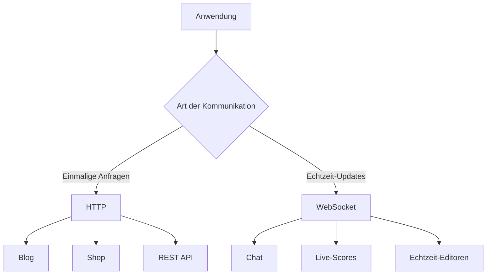
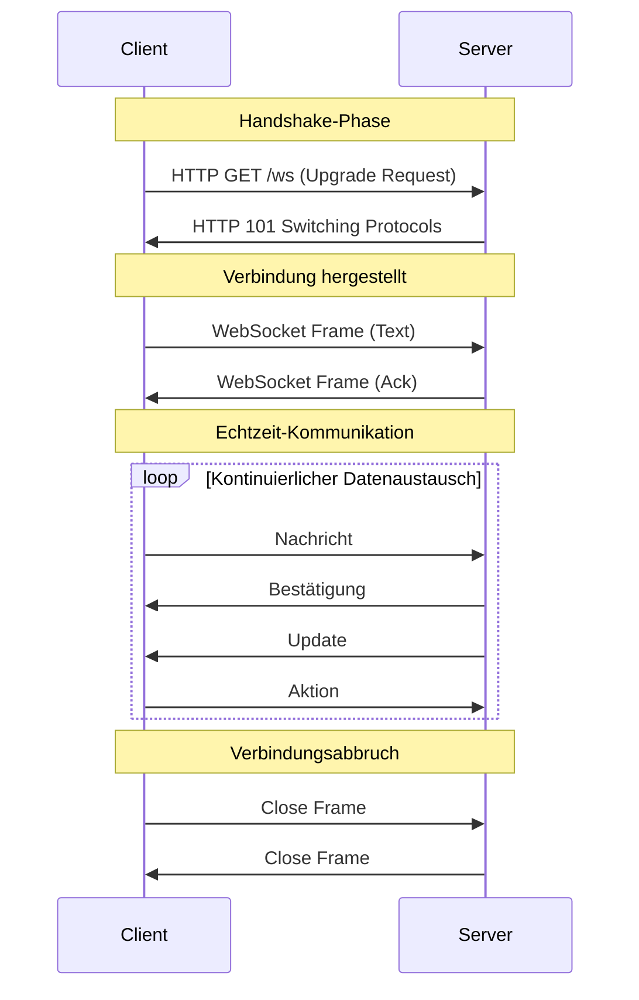
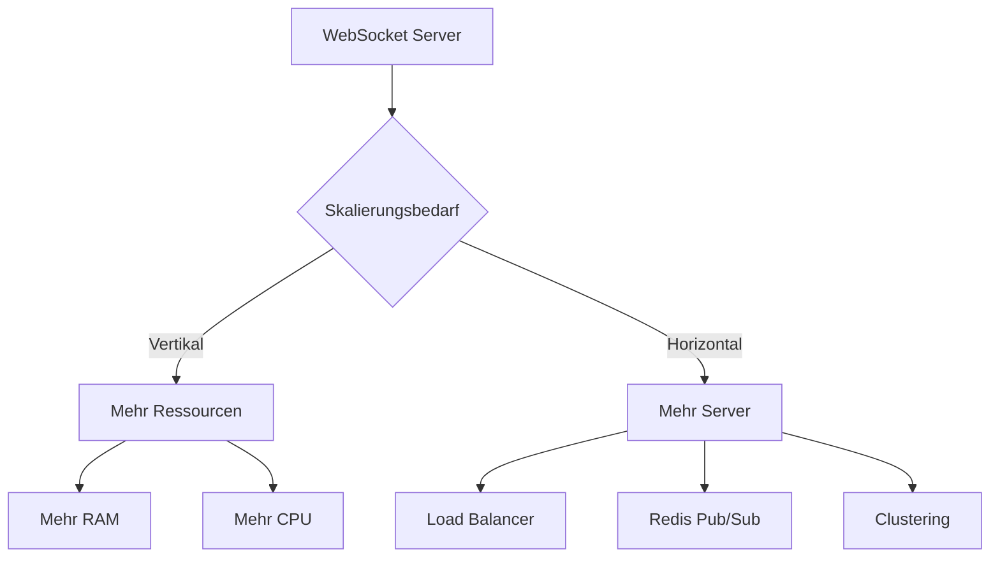

# WebSocket-Server in NodeJS

WebSockets ermöglichen eine bidirektionale, Echtzeit-Kommunikation zwischen Client und Server. Im Gegensatz zu HTTP, das auf Request-Response basiert, bleibt die WebSocket-Verbindung offen und erlaubt kontinuierlichen Datenaustausch.


## WebSocket vs. HTTP: Wann was verwenden?

### HTTP (REST) ist ideal für:
- Einmalige Anfragen und Antworten
- Statische Inhalte
- CRUD-Operationen
- Caching-fähige Daten
- SEO-relevante Inhalte
- Einfache API-Endpunkte

### WebSocket ist ideal für:
- Echtzeit-Kommunikation
- Bidirektionaler Datenaustausch
- Live-Updates
- Chat-Anwendungen
- Multiplayer-Spiele
- Live-Dashboards
- Echtzeit-Kollaboration

### Vergleichstabelle

| Aspekt | HTTP | WebSocket |
|--------|------|-----------|
| Verbindung | Kurzlebig | Persistent |
| Datenfluss | Unidirektional | Bidirektional |
| Overhead | Höher (Header) | Niedriger |
| Latenz | Höher | Niedriger |
| Skalierung | Einfacher | Komplexer |
| Caching | Gut möglich | Nicht möglich |
| Browser-Support | Universell | Modern |

### Typische Anwendungsfälle



### Kommunikationsverlauf



## Installation

Um einen WebSocket-Server zu erstellen, benötigen wir zunächst das `ws`-Paket. Dieses Paket bietet eine einfache und effiziente Implementierung des WebSocket-Protokolls für NodeJS.

```bash
npm install ws
```

## Grundlegender WebSocket-Server

Hier ist ein einfaches Beispiel für einen WebSocket-Server. Der Server lauscht auf Port 8080 und verarbeitet eingehende Verbindungen. Für jede Verbindung werden Event-Handler für Nachrichten, Verbindungsabbruch und Fehler eingerichtet.

```javascript
const WebSocket = require('ws');

// Server erstellen
const wss = new WebSocket.Server({ port: 8080 });

// Verbindungs-Handler
wss.on('connection', function connection(ws) {
    console.log('Neue Verbindung hergestellt');

    // Nachrichten-Handler
    ws.on('message', function incoming(message) {
        console.log('Empfangene Nachricht:', message.toString());
        
        // Echo zurück an den Client
        ws.send(`Server hat empfangen: ${message}`);
    });

    // Verbindungsabbruch-Handler
    ws.on('close', function close() {
        console.log('Verbindung geschlossen');
    });

    // Fehler-Handler
    ws.on('error', function error(err) {
        console.error('WebSocket Fehler:', err);
    });
});

console.log('WebSocket-Server läuft auf Port 8080');
```

## Erweiterte Funktionen

### 1. Broadcast an alle Clients

Die Broadcast-Funktion ermöglicht es, Nachrichten an alle verbundenen Clients zu senden. Dies ist besonders nützlich für Chat-Anwendungen oder Live-Updates. Die Funktion prüft den Verbindungsstatus jedes Clients, bevor die Nachricht gesendet wird.

```javascript
// Broadcast-Funktion
function broadcast(message) {
    wss.clients.forEach(function each(client) {
        if (client.readyState === WebSocket.OPEN) {
            client.send(message);
        }
    });
}

// Verwendung im message-Handler
ws.on('message', function incoming(message) {
    broadcast(message.toString());
});
```

### 2. Client-Verwaltung

Eine effektive Client-Verwaltung ist wichtig für die Skalierbarkeit und Wartbarkeit des Servers. In diesem Beispiel speichern wir Client-Informationen in einer Map und verwalten den Lebenszyklus der Verbindungen.

```javascript
// Client-Informationen speichern
const clients = new Map();

wss.on('connection', function connection(ws) {
    const id = Date.now();
    clients.set(id, ws);

    // Client-ID senden
    ws.send(JSON.stringify({
        type: 'connection',
        id: id
    }));

    // Client entfernen bei Verbindungsabbruch
    ws.on('close', function close() {
        clients.delete(id);
    });
});
```

### 3. Nachrichten-Typen

Die Strukturierung von Nachrichten in verschiedene Typen hilft bei der Organisation und Verarbeitung der Kommunikation. Jeder Nachrichtentyp kann unterschiedlich behandelt werden, was die Wartbarkeit und Erweiterbarkeit des Codes verbessert.

```javascript
// Nachrichten-Struktur
const messageTypes = {
    CHAT: 'chat',
    SYSTEM: 'system',
    USER_JOINED: 'user_joined',
    USER_LEFT: 'user_left'
};

// Nachrichten-Handler
ws.on('message', function incoming(message) {
    try {
        const data = JSON.parse(message);
        
        switch(data.type) {
            case messageTypes.CHAT:
                handleChatMessage(data);
                break;
            case messageTypes.SYSTEM:
                handleSystemMessage(data);
                break;
            default:
                console.log('Unbekannter Nachrichtentyp:', data.type);
        }
    } catch (err) {
        console.error('Fehler beim Verarbeiten der Nachricht:', err);
    }
});
```

## Sicherheit

### 1. Authentifizierung

Die Authentifizierung ist ein wichtiger Aspekt der WebSocket-Sicherheit. In diesem Beispiel wird ein Token-basierter Authentifizierungsmechanismus implementiert, der vor dem Aufbau der WebSocket-Verbindung überprüft wird.

```javascript
const wss = new WebSocket.Server({ 
    port: 8080,
    verifyClient: function(info, callback) {
        // Token aus URL-Parametern extrahieren
        const token = new URL(info.req.url, 'ws://localhost').searchParams.get('token');
        
        if (isValidToken(token)) {
            callback(true);
        } else {
            callback(false, 401, 'Unauthorized');
        }
    }
});
```

### 2. Rate Limiting

Rate Limiting verhindert Missbrauch des Servers durch zu viele Anfragen von einem einzelnen Client. Dieses Beispiel implementiert ein einfaches Zeitfenster-basiertes Rate Limiting.

```javascript
const rateLimit = new Map();

wss.on('connection', function connection(ws, req) {
    const ip = req.socket.remoteAddress;
    const limit = {
        count: 0,
        lastReset: Date.now()
    };
    
    rateLimit.set(ip, limit);

    ws.on('message', function incoming(message) {
        const now = Date.now();
        const userLimit = rateLimit.get(ip);

        // Limit zurücksetzen nach 1 Minute
        if (now - userLimit.lastReset > 60000) {
            userLimit.count = 0;
            userLimit.lastReset = now;
        }

        // Prüfen ob Limit überschritten
        if (userLimit.count > 100) {
            ws.close(1008, 'Rate limit exceeded');
            return;
        }

        userLimit.count++;
        // Nachricht verarbeiten...
    });
});
```

## Beispiel: Chat-Anwendung

Dieses Beispiel zeigt eine vollständige Chat-Anwendung mit Benutzer-Verwaltung und Nachrichten-Broadcasting. Es demonstriert die praktische Anwendung der zuvor besprochenen Konzepte.

```javascript
const WebSocket = require('ws');
const wss = new WebSocket.Server({ port: 8080 });

// Benutzer-Verwaltung
const users = new Map();

wss.on('connection', function connection(ws) {
    let userId = null;

    // Benutzer-Anmeldung
    ws.on('message', function incoming(message) {
        const data = JSON.parse(message);

        if (data.type === 'login') {
            userId = data.userId;
            users.set(userId, {
                ws: ws,
                name: data.name
            });

            // Anmeldung broadcasten
            broadcast({
                type: 'system',
                message: `${data.name} ist dem Chat beigetreten`
            });
        }
        else if (data.type === 'chat') {
            // Chat-Nachricht broadcasten
            broadcast({
                type: 'chat',
                userId: userId,
                name: users.get(userId).name,
                message: data.message
            });
        }
    });

    // Verbindungsabbruch
    ws.on('close', function close() {
        if (userId) {
            const user = users.get(userId);
            users.delete(userId);
            
            broadcast({
                type: 'system',
                message: `${user.name} hat den Chat verlassen`
            });
        }
    });
});

function broadcast(message) {
    wss.clients.forEach(function each(client) {
        if (client.readyState === WebSocket.OPEN) {
            client.send(JSON.stringify(message));
        }
    });
}
```

## Best Practices

Die folgenden Best Practices helfen dabei, einen robusten und wartbaren WebSocket-Server zu entwickeln. Sie decken wichtige Aspekte wie Fehlerbehandlung, Verbindungsmanagement und Skalierung ab.

1. **Fehlerbehandlung**
   - Implementiere robuste Fehlerbehandlung
   - Logge Fehler für Debugging
   - Sende aussagekräftige Fehlermeldungen an Clients

2. **Verbindungsmanagement**
   - Überwache Verbindungsstatus
   - Implementiere Reconnect-Logik
   - Setze Timeouts für inaktive Verbindungen

3. **Nachrichtenverarbeitung**
   - Validiere eingehende Nachrichten
   - Nutze strukturierte Nachrichtenformate (JSON)
   - Implementiere Nachrichten-Queuing bei hoher Last

4. **Skalierung**
   - Nutze Load Balancing für mehrere Server
   - Implementiere Clustering für horizontale Skalierung
   - Verwende Redis für Server-übergreifende Kommunikation

## Debugging

Debugging ist ein wichtiger Teil der WebSocket-Entwicklung. Das folgende Beispiel zeigt, wie man grundlegendes Logging implementiert, um den Verbindungsstatus und die Nachrichtenverarbeitung zu überwachen.

```javascript
// Debug-Logging
wss.on('connection', function connection(ws) {
    console.log('Neue Verbindung');
    
    ws.on('message', function incoming(message) {
        console.log('Nachricht empfangen:', message.toString());
    });

    ws.on('error', function error(err) {
        console.error('WebSocket Fehler:', err);
    });

    ws.on('close', function close() {
        console.log('Verbindung geschlossen');
    });
});
```

## Skalierung und Performance

### Verbindungslimits und Ressourcen

Die Anzahl der gleichzeitigen WebSocket-Verbindungen hängt von verschiedenen Faktoren ab:

1. **Server-Ressourcen**:
   - RAM: ~2-4KB pro Verbindung
   - CPU: Abhängig von der Nachrichtenverarbeitung
   - Netzwerk: Bandbreite und Verbindungslimit des OS

2. **Betriebssystem-Limits**:
   - Maximale Datei-Deskriptoren
   - TCP/IP-Stack-Konfiguration
   - Netzwerk-Interface-Limits

3. **Node.js-Limits**:
   - Event Loop Performance
   - V8 Engine Memory Limits
   - Libuv Thread Pool

### Typische Skalierungszahlen

| Server-Typ | Verbindungen | Nachrichten/Sekunde |
|------------|--------------|---------------------|
| Einzelner Node.js-Prozess | 10.000-50.000 | 10.000-100.000 |
| Mit Load Balancer | 100.000+ | 100.000+ |
| Mit Clustering | 500.000+ | 500.000+ |

### Skalierungsstrategien



#### 1. Vertikale Skalierung
- Erhöhung der Server-Ressourcen
- Optimierung der Node.js-Konfiguration
- Verbesserung der Code-Effizienz

#### 2. Horizontale Skalierung
- Load Balancing zwischen Servern
- Redis für Server-übergreifende Kommunikation
- Clustering mit PM2 oder Kubernetes

### Performance-Optimierungen

1. **Verbindungsoptimierung**:
   ```javascript
   const wss = new WebSocket.Server({
       perMessageDeflate: {
           zlibDeflateOptions: {
               level: 3 // Kompressionslevel (1-9)
           },
           zlibInflateOptions: {
               chunkSize: 10 * 1024 // 10KB
           }
       },
       maxPayload: 50 * 1024 * 1024 // 50MB
   });
   ```

2. **Memory Management**:
   ```javascript
   // Regelmäßige Bereinigung
   setInterval(() => {
       wss.clients.forEach(client => {
           if (client.isAlive === false) {
               return client.terminate();
           }
           client.isAlive = false;
           client.ping();
       });
   }, 30000);
   ```

3. **Load Balancing**:
   ```javascript
   // Nginx Konfiguration
   upstream websocket {
       server 127.0.0.1:8080;
       server 127.0.0.1:8081;
       server 127.0.0.1:8082;
   }
   ```

### Monitoring und Metriken

Wichtige Metriken für die Überwachung:

1. **Verbindungsmetriken**:
   - Aktive Verbindungen
   - Verbindungsrate
   - Durchschnittliche Verbindungsdauer

2. **Performance-Metriken**:
   - Nachrichten pro Sekunde
   - Latenz
   - Memory-Verbrauch

3. **Fehler-Metriken**:
   - Verbindungsabbrüche
   - Fehlerrate
   - Timeout-Rate

### Best Practices für Skalierung

1. **Architektur**:
   - Microservices-Ansatz
   - Stateless Server
   - Caching-Strategien

2. **Monitoring**:
   - Echtzeit-Metriken
   - Alerting
   - Logging

3. **Wartung**:
   - Regelmäßige Updates
   - Performance-Tests
   - Kapazitätsplanung

## Nächste Schritte

Nachdem du die Grundlagen des WebSocket-Servers und seine Skalierungsmöglichkeiten kennengelernt hast, kannst du mit dem [Express.js](express.md) Modul fortfahren, um HTTP und WebSocket in einer Anwendung zu kombinieren. 