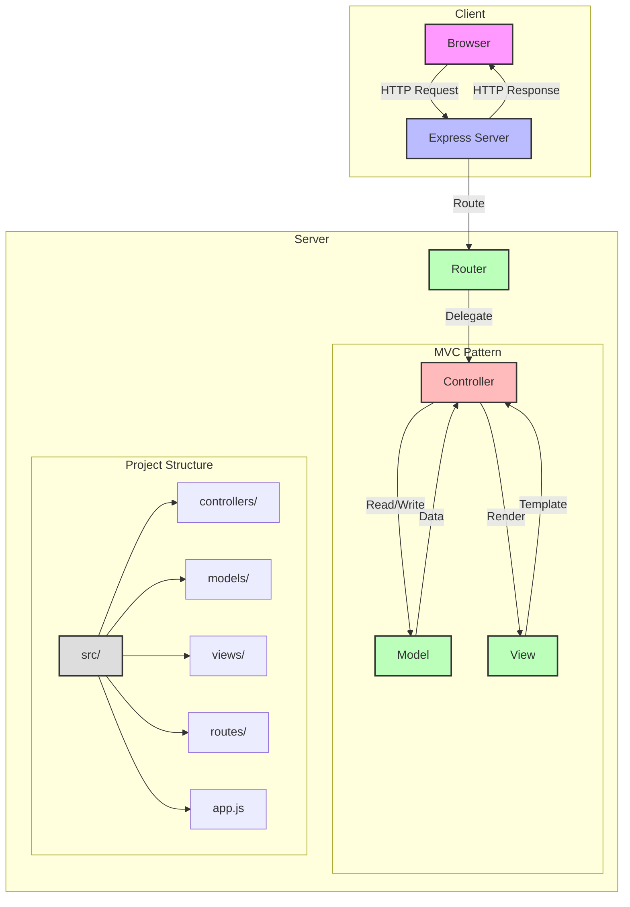

# Controller, Router & Templates

In diesem Modul lernst du, wie man das Model-View-Controller (MVC) Pattern in Express.js-Anwendungen implementiert.

## Lernziele

- MVC-Architektur verstehen und implementieren
- Controller für Request-Handling erstellen
- Router für URL-Routing konfigurieren
- Models für Datenlogik entwickeln
- Views mit Controllern verbinden

## MVC-Architektur

Das folgende Diagramm zeigt die grundlegende Struktur einer MVC-Anwendung. Es verdeutlicht die Kommunikation zwischen Client und Server sowie die internen Beziehungen der MVC-Komponenten:



## MVC-Grundlagen

### Projektstruktur

Eine gut organisierte Projektstruktur ist entscheidend für die Wartbarkeit einer MVC-Anwendung. Die folgende Struktur trennt klar die verschiedenen Komponenten und folgt bewährten Praktiken:

```
src/
├── controllers/
│   ├── userController.js
│   └── postController.js
├── models/
│   ├── userModel.js
│   └── postModel.js
├── views/
│   ├── users/
│   └── posts/
├── routes/
│   ├── userRoutes.js
│   └── postRoutes.js
└── app.js
```

## Controller-Implementierung

### User Controller

Der User Controller ist ein Beispiel für die Implementierung der CRUD-Operationen (Create, Read, Update, Delete). Er zeigt, wie Requests verarbeitet und mit dem Model und der View interagiert wird:

```javascript
// controllers/userController.js
export class UserController {
    // Alle Benutzer anzeigen
    async index(req, res) {
        try {
            const users = await UserModel.findAll();
            res.render('users/index', { users });
        } catch (error) {
            res.status(500).render('error', { error });
        }
    }

    // Einzelnen Benutzer anzeigen
    async show(req, res) {
        try {
            const user = await UserModel.findById(req.params.id);
            if (!user) {
                return res.status(404).render('error', { 
                    message: 'Benutzer nicht gefunden' 
                });
            }
            res.render('users/show', { user });
        } catch (error) {
            res.status(500).render('error', { error });
        }
    }

    // Neuen Benutzer erstellen
    async create(req, res) {
        try {
            const user = await UserModel.create(req.body);
            res.redirect(`/users/${user.id}`);
        } catch (error) {
            res.status(400).render('users/new', { 
                error,
                user: req.body 
            });
        }
    }

    // Benutzer aktualisieren
    async update(req, res) {
        try {
            const user = await UserModel.update(req.params.id, req.body);
            res.redirect(`/users/${user.id}`);
        } catch (error) {
            res.status(400).render('users/edit', { 
                error,
                user: req.body 
            });
        }
    }

    // Benutzer löschen
    async delete(req, res) {
        try {
            await UserModel.delete(req.params.id);
            res.redirect('/users');
        } catch (error) {
            res.status(500).render('error', { error });
        }
    }
}
```

## Router-Konfiguration

### User Routes

Die Router-Konfiguration definiert die API-Endpunkte und verbindet sie mit den entsprechenden Controller-Methoden. Hier sehen wir ein Beispiel für RESTful Routes:

```javascript
// routes/userRoutes.js
import express from 'express';
import { UserController } from '../controllers/userController.js';

const router = express.Router();
const userController = new UserController();

// RESTful Routes
router.get('/users', userController.index);
router.get('/users/new', userController.new);
router.post('/users', userController.create);
router.get('/users/:id', userController.show);
router.get('/users/:id/edit', userController.edit);
router.put('/users/:id', userController.update);
router.delete('/users/:id', userController.delete);

export default router;
```

### App.js Integration

Die Hauptanwendungsdatei (app.js) ist der Einstiegspunkt der Anwendung. Sie konfiguriert Middleware, View-Engine und verbindet alle Komponenten:

```javascript
// app.js
import express from 'express';
import userRoutes from './routes/userRoutes.js';
import postRoutes from './routes/postRoutes.js';

const app = express();

// Middleware
app.use(express.json());
app.use(express.urlencoded({ extended: true }));
app.use(express.static('public'));

// View Engine
app.set('view engine', 'ejs');
app.set('views', './views');

// Routes
app.use('/', userRoutes);
app.use('/', postRoutes);

// Error Handler
app.use((err, req, res, next) => {
    console.error(err.stack);
    res.status(500).render('error', { error: err });
});
```

## Model-Entwicklung

### User Model

Das User Model kapselt die Datenlogik und Datenbankoperationen. Es bietet eine saubere Schnittstelle für den Controller:

```javascript
// models/userModel.js
export class UserModel {
    static async findAll() {
        // Datenbankabfrage
        return [];
    }

    static async findById(id) {
        // Datenbankabfrage
        return null;
    }

    static async create(userData) {
        // Datenbankabfrage
        return { id: 1, ...userData };
    }

    static async update(id, userData) {
        // Datenbankabfrage
        return { id, ...userData };
    }

    static async delete(id) {
        // Datenbankabfrage
        return true;
    }
}
```

## View-Integration

### User Views

Die Views sind für die Darstellung der Daten zuständig. Hier sehen wir ein Beispiel für eine EJS-Template-Datei, die Benutzerdaten in einer Tabelle anzeigt:

```ejs
<!-- views/users/index.ejs -->
<h1>Benutzer</h1>
<a href="/users/new">Neuer Benutzer</a>

<table>
    <thead>
        <tr>
            <th>Name</th>
            <th>Email</th>
            <th>Aktionen</th>
        </tr>
    </thead>
    <tbody>
        <% users.forEach(function(user) { %>
            <tr>
                <td><%= user.name %></td>
                <td><%= user.email %></td>
                <td>
                    <a href="/users/<%= user.id %>">Anzeigen</a>
                    <a href="/users/<%= user.id %>/edit">Bearbeiten</a>
                    <form action="/users/<%= user.id %>?_method=DELETE" method="POST">
                        <button type="submit">Löschen</button>
                    </form>
                </td>
            </tr>
        <% }); %>
    </tbody>
</table>
```

## Best Practices

1. **Controller**
   - Single Responsibility Principle
   - Klare Methodennamen
   - Fehlerbehandlung
   - Input-Validierung

2. **Router**
   - RESTful Routes
   - Middleware-Integration
   - Route-Gruppierung
   - Parameter-Validierung

3. **Model**
   - Datenbank-Abstraktion
   - Validierungslogik
   - Beziehungen
   - Transaktionen

4. **View**
   - Wiederverwendbare Komponenten
   - Klare Struktur
   - Fehleranzeige
   - Formulare

## Nächste Schritte

Nach Abschluss dieses Moduls kannst du mit dem [TypeORM Integration](typeorm.md) Modul fortfahren. 