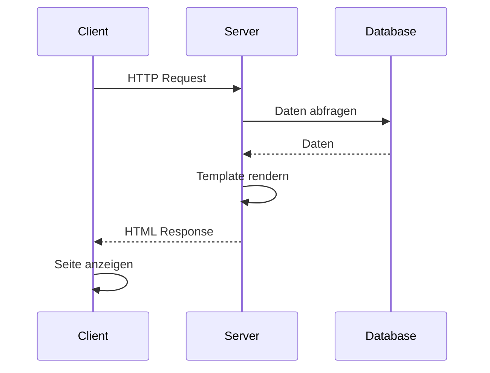
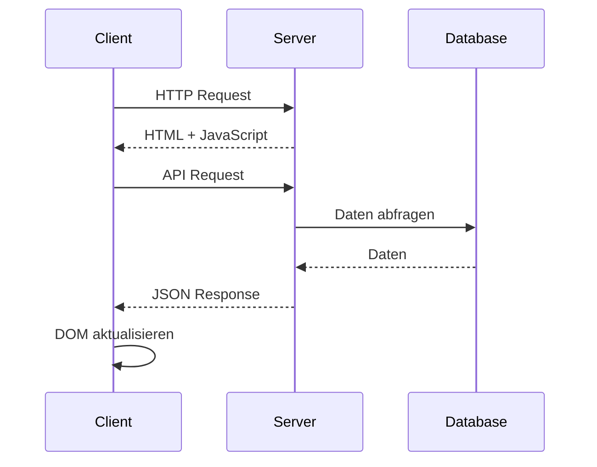

# EJS Templating

In diesem Modul lernst du, wie man mit der EJS (Embedded JavaScript) Templating Engine dynamische Webseiten in Express.js erstellt.

## Lernziele

- EJS-Templates erstellen und strukturieren
- Layouts und Partials verwenden
- Dynamische Daten einbinden
- Template-Helper nutzen
- Best Practices für Template-Organisation


## Server-Side vs. Client-Side Rendering

### Request-Response Flows

#### Server-Side Rendering (SSR)


#### Client-Side Rendering (CSR)


### Vergleich Server-Side vs. Client-Side Rendering

| Aspekt | Server-Side Rendering | Client-Side Rendering |
|--------|----------------------|----------------------|
| Initiale Ladezeit | Schneller (komplettes HTML) | Langsamer (JS muss geladen werden) |
| SEO | Besser (Suchmaschinen sehen Inhalt) | Schlechter (Inhalt wird dynamisch geladen) |
| Server-Last | Höher (Rendering auf Server) | Niedriger (nur API-Requests) |
| Interaktivität | Verzögert (neue Server-Requests) | Sofort (Client-seitige Updates) |
| Offline-Fähigkeit | Nein | Ja (mit Service Workers) |
| Entwicklung | Einfacher (weniger Komplexität) | Komplexer (State Management) |

### Rendering-Optionen im JS/Node-Ökosystem

| Rendering-Typ | Frameworks/Tools | Besonderheiten |
|--------------|-----------------|----------------|
| **Server-Side Rendering (SSR)** | EJS, Pug/Jade, Handlebars | Einfache Template-Engine, direkte HTML-Generierung |
| | Next.js (React) | React-basiert, automatisches Code-Splitting |
| | Nuxt.js (Vue) | Vue-basiert, modulare Architektur |
| **Client-Side Rendering (CSR)** | React | Komponenten-basiert, Virtual DOM |
| | Vue.js | Reaktive Datenbindung, sanfte Lernkurve |
| | Angular | Vollständiges Framework, TypeScript |
| | Svelte | Kompilierter Ansatz, geringe Bundle-Größe |
| **Hybrid-Ansätze** | Next.js (SSR + CSR) | Universelles Rendering, API-Routes |
| | Nuxt.js (SSR + CSR) | Vue-basiert, automatische Routen |
| | Remix | Nested Routing, optimierte Datenladung |
| | Astro | Islands Architecture, partielle Hydration |
| **Static Site Generation (SSG)** | Next.js (Static) | Statische Seiten mit dynamischen Elementen |
| | Nuxt.js (Static) | Vue-basiert, statische Seiten-Generierung |
| | Gatsby | GraphQL-basiert, Plugin-System |
| | Astro | Zero JavaScript by default |

## EJS: Setup und Konfiguration

Die grundlegende Konfiguration von EJS in einer Express.js-Anwendung erfordert einige wichtige Einstellungen. Der folgende Code zeigt, wie die View Engine konfiguriert und die Verzeichnisstruktur eingerichtet wird:

```javascript
import express from 'express';
import { fileURLToPath } from 'url';
import { dirname } from 'path';

const __filename = fileURLToPath(import.meta.url);
const __dirname = dirname(__filename);

const app = express();

// EJS als View Engine setzen
app.set('view engine', 'ejs');
app.set('views', path.join(__dirname, 'views'));
```

## Template-Basics

### Syntax

EJS verwendet eine einfache Syntax, die JavaScript in HTML einbettet. Die wichtigsten Tags sind `<%= %>` für die Ausgabe von Werten und `<% %>` für JavaScript-Logik. Hier ein Beispiel mit verschiedenen Anwendungsfällen:

```ejs
<!-- views/index.ejs -->
<!DOCTYPE html>
<html>
<head>
    <title><%= title %></title>
</head>
<body>
    <h1><%= title %></h1>
    <p><%= message %></p>
    
    <% if (user) { %>
        <p>Willkommen, <%= user.name %>!</p>
    <% } else { %>
        <p>Bitte <a href="/login">anmelden</a></p>
    <% } %>
    
    <ul>
    <% items.forEach(function(item) { %>
        <li><%= item.name %></li>
    <% }); %>
    </ul>
</body>
</html>
```

### Rendering

Das Rendering von Templates erfolgt über die `render`-Methode des Response-Objekts. Dabei werden die Template-Daten als Objekt übergeben. Dieses Beispiel zeigt, wie verschiedene Datentypen an das Template übergeben werden:

```javascript
app.get('/', (req, res) => {
    res.render('index', {
        title: 'Meine EJS App',
        message: 'Willkommen!',
        user: { name: 'Max' },
        items: [
            { name: 'Item 1' },
            { name: 'Item 2' }
        ]
    });
});
```

## Layouts und Partials

### Layout

Layouts definieren die Grundstruktur einer Webseite und ermöglichen die Wiederverwendung von gemeinsamem Code. Ein Layout-Template enthält typischerweise den HTML-Grundaufbau und Platzhalter für dynamische Inhalte:

```ejs
<!-- views/layouts/main.ejs -->
<!DOCTYPE html>
<html>
<head>
    <title><%= title %></title>
    <%- include('../partials/head') %>
</head>
<body>
    <%- include('../partials/header') %>
    
    <main>
        <%- body %>
    </main>
    
    <%- include('../partials/footer') %>
</body>
</html>
```

### Partials

Partials sind wiederverwendbare Template-Teile, die in verschiedene Templates eingebunden werden können. Sie sind ideal für sich wiederholende Elemente wie Header, Footer oder Navigation:

```ejs
<!-- views/partials/head.ejs -->
<meta charset="UTF-8">
<link rel="stylesheet" href="/css/style.css">

<!-- views/partials/header.ejs -->
<header>
    <nav>
        <a href="/">Home</a>
        <a href="/about">About</a>
    </nav>
</header>

<!-- views/partials/footer.ejs -->
<footer>
    <p>&copy; 2024 Meine App</p>
</footer>
```

## Daten und Logik

### Daten übergeben

Die Übergabe von Daten an Templates kann auf verschiedenen Ebenen erfolgen. Globale Daten sind für alle Templates verfügbar, während route-spezifische Daten nur für bestimmte Views gelten:

```javascript
// Globale Daten
app.locals.appName = 'Meine App';

// Route-spezifische Daten
app.get('/profile', (req, res) => {
    res.render('profile', {
        user: {
            name: 'Max',
            email: 'max@example.com'
        }
    });
});
```

### Bedingte Anzeige

Bedingte Anzeige ermöglicht es, Inhalte basierend auf bestimmten Bedingungen zu rendern. Dies ist besonders nützlich für personalisierte Inhalte oder Berechtigungsprüfungen:

```ejs
<% if (user.isAdmin) { %>
    <div class="admin-panel">
        <h2>Admin-Bereich</h2>
        <!-- Admin-Funktionen -->
    </div>
<% } %>
```

### Schleifen

Schleifen in EJS ermöglichen die dynamische Generierung von Listen und Tabellen. Hier ein Beispiel für die Darstellung von Benutzerdaten in einer Tabelle:

```ejs
<table>
    <thead>
        <tr>
            <th>Name</th>
            <th>Email</th>
        </tr>
    </thead>
    <tbody>
        <% users.forEach(function(user) { %>
            <tr>
                <td><%= user.name %></td>
                <td><%= user.email %></td>
            </tr>
        <% }); %>
    </tbody>
</table>
```

## Template-Helper

### Eigene Helper

Helper-Funktionen erweitern die Funktionalität von EJS-Templates. Sie können für Formatierung, Berechnungen oder andere wiederkehrende Aufgaben verwendet werden:

```javascript
// Helper registrieren
app.locals.formatDate = function(date) {
    return new Date(date).toLocaleDateString();
};

app.locals.uppercase = function(str) {
    return str.toUpperCase();
};
```

### Helper verwenden

Die registrierten Helper können direkt in den Templates verwendet werden. Sie vereinfachen die Template-Logik und machen den Code lesbarer:

```ejs
<p>Erstellt am: <%= formatDate(post.createdAt) %></p>
<h2><%= uppercase(post.title) %></h2>
```

## Best Practices

1. **Template-Organisation**
   - Klare Verzeichnisstruktur
   - Wiederverwendbare Komponenten
   - Konsistente Namensgebung

2. **Performance**
   - Caching aktivieren
   - Partials optimieren
   - Minimale Logik in Templates

3. **Sicherheit**
   - XSS-Schutz
   - Input-Validierung
   - Escaping von Daten

## Nächste Schritte

Nach Abschluss dieses Moduls kannst du mit dem [MVC Pattern](mvc.md) Modul fortfahren. 