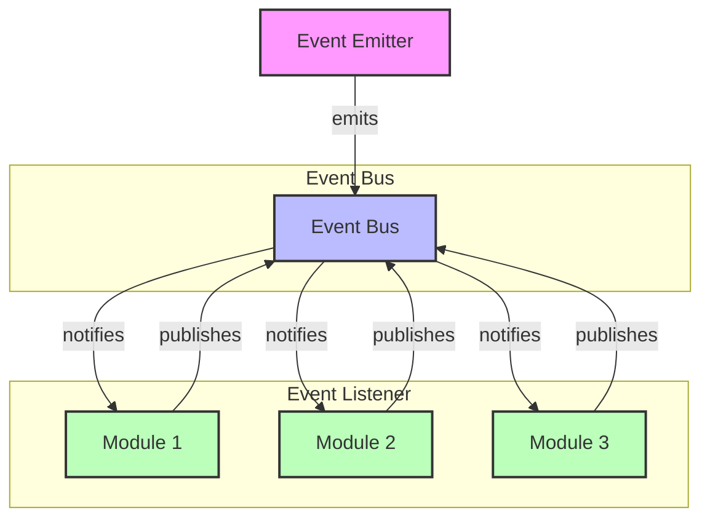

# Event-basierte Programmierung in NodeJS

In diesem Abschnitt lernst du die Grundlagen der Event-basierten Programmierung in NodeJS kennen.

## Lernziele

- Event Emitter verstehen und nutzen
- Eigene Events erstellen und verarbeiten
- Event-basierte Architektur implementieren
- Best Practices für Event-Handling

## Event-Architektur

Die folgende Abbildung zeigt, wie eine typische Event-basierte Architektur in einer Node.js-Anwendung aussehen kann:



## Grundlagen

### Event Emitter importieren

Der Event Emitter ist ein zentrales Modul in Node.js für die Event-basierte Programmierung. Er ermöglicht das Erstellen und Verarbeiten von Events:

```javascript
import { EventEmitter } from 'events';
```

## Event Emitter

### Basis-Event Emitter

Ein einfacher Event Emitter demonstriert die grundlegende Funktionsweise: Ein Event wird ausgelöst und von einem Listener empfangen:

```javascript
import { EventEmitter } from 'events';

// Event Emitter erstellen
const emitter = new EventEmitter();

// Event Listener registrieren
emitter.on('event', (data) => {
    console.log('Event empfangen:', data);
});

// Event auslösen
emitter.emit('event', { message: 'Hallo Welt' });
```

### Mehrere Listener

Ein Event kann von mehreren Listenern empfangen werden. Diese werden in der Reihenfolge ihrer Registrierung ausgeführt:

```javascript
import { EventEmitter } from 'events';

const emitter = new EventEmitter();

// Erster Listener
emitter.on('event', (data) => {
    console.log('Listener 1:', data);
});

// Zweiter Listener
emitter.on('event', (data) => {
    console.log('Listener 2:', data);
});

// Event auslösen
emitter.emit('event', 'Test');
```

## Eigene Event Emitter

### Klasse mit Events

Durch Erweitern der EventEmitter-Klasse können eigene Klassen mit Event-Funktionalität erstellt werden. Dies ermöglicht eine lose Kopplung zwischen verschiedenen Teilen der Anwendung:

```javascript
import { EventEmitter } from 'events';

class UserManager extends EventEmitter {
    constructor() {
        super();
        this.users = new Map();
    }

    addUser(user) {
        this.users.set(user.id, user);
        this.emit('userAdded', user);
    }

    removeUser(id) {
        const user = this.users.get(id);
        if (user) {
            this.users.delete(id);
            this.emit('userRemoved', user);
        }
    }
}

// Verwendung
const userManager = new UserManager();

userManager.on('userAdded', (user) => {
    console.log('Neuer Benutzer:', user);
});

userManager.on('userRemoved', (user) => {
    console.log('Benutzer entfernt:', user);
});
```

## Event-Handling

### Einmalige Events

Mit `once` können Events registriert werden, die nur einmal ausgeführt werden. Dies ist nützlich für einmalige Aktionen oder Initialisierungen:

```javascript
import { EventEmitter } from 'events';

const emitter = new EventEmitter();

// Event nur einmal ausführen
emitter.once('event', (data) => {
    console.log('Event einmalig empfangen:', data);
});

emitter.emit('event', 'Erstes Event'); // Wird ausgeführt
emitter.emit('event', 'Zweites Event'); // Wird ignoriert
```

### Event-Entfernung

Events können dynamisch entfernt werden, wenn sie nicht mehr benötigt werden. Dies ist wichtig für die Vermeidung von Memory Leaks:

```javascript
import { EventEmitter } from 'events';

const emitter = new EventEmitter();

function eventHandler(data) {
    console.log('Event empfangen:', data);
}

// Listener registrieren
emitter.on('event', eventHandler);

// Listener entfernen
emitter.off('event', eventHandler);
```

## Best Practices

### Fehlerbehandlung

Eine robuste Fehlerbehandlung ist in Event-basierten Systemen besonders wichtig, da Events asynchron verarbeitet werden:

- Error-Events implementieren
- Try-Catch in Event-Handlern
- Fehler propagieren
- Ressourcen aufräumen

### Performance

Die Performance von Event-basierten Systemen hängt stark von der effizienten Implementierung ab:

- Listener-Limit beachten
- Unnötige Events vermeiden
- Event-Queue optimieren
- Memory Leaks verhindern

### Code-Organisation

Eine gute Strukturierung des Event-basierten Codes ist entscheidend für die Wartbarkeit:

- Events dokumentieren
- Handler modular aufbauen
- Event-Namen standardisieren
- Abhängigkeiten minimieren

## Beispiele

### Chat-System

Ein Chat-System demonstriert die praktische Anwendung von Events in einer Echtzeit-Anwendung:

```javascript
import { EventEmitter } from 'events';

class ChatRoom extends EventEmitter {
    constructor() {
        super();
        this.messages = [];
    }

    sendMessage(user, message) {
        const chatMessage = {
            user,
            message,
            timestamp: new Date()
        };
        this.messages.push(chatMessage);
        this.emit('message', chatMessage);
    }

    join(user) {
        this.emit('userJoined', user);
    }

    leave(user) {
        this.emit('userLeft', user);
    }
}

// Verwendung
const chat = new ChatRoom();

chat.on('message', (msg) => {
    console.log(`${msg.user}: ${msg.message}`);
});

chat.on('userJoined', (user) => {
    console.log(`${user} ist dem Chat beigetreten`);
});

chat.on('userLeft', (user) => {
    console.log(`${user} hat den Chat verlassen`);
});
```

### Datei-Watcher

Ein Datei-Watcher zeigt, wie Events für die Überwachung von Dateisystem-Änderungen genutzt werden können:

```javascript
import { EventEmitter } from 'events';
import { watch } from 'fs';

class FileWatcher extends EventEmitter {
    constructor(filePath) {
        super();
        this.filePath = filePath;
        this.watcher = null;
    }

    start() {
        this.watcher = watch(this.filePath, (eventType, filename) => {
            this.emit('change', {
                type: eventType,
                file: filename,
                timestamp: new Date()
            });
        });
    }

    stop() {
        if (this.watcher) {
            this.watcher.close();
            this.emit('stopped');
        }
    }
}

// Verwendung
const watcher = new FileWatcher('datei.txt');

watcher.on('change', (info) => {
    console.log('Datei geändert:', info);
});

watcher.on('stopped', () => {
    console.log('Watcher gestoppt');
});
```