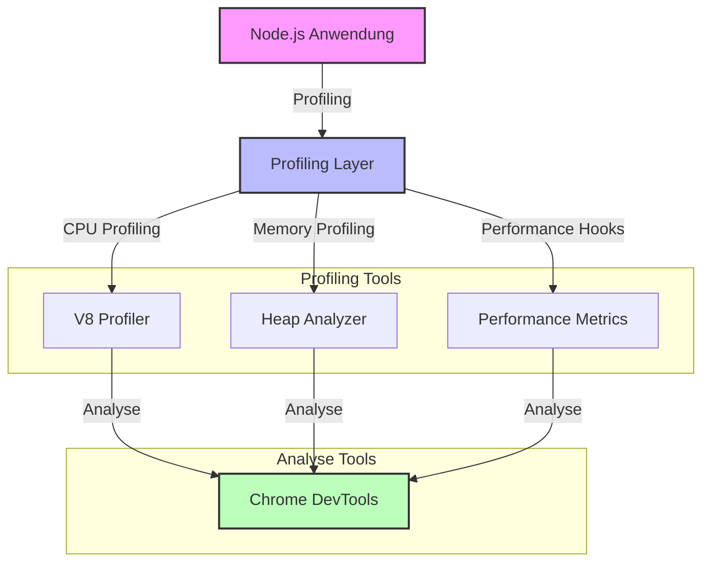

# Profiling in NodeJS

## Einführung

Profiling ist ein wichtiges Werkzeug zur Performance-Analyse und Optimierung von NodeJS-Anwendungen. In diesem Modul lernst du verschiedene Profiling-Techniken und Tools kennen.

## Performance-Messung im Überblick

### Vergleichstabelle der Profiling-Methoden

| Methode | Vorteile | Nachteile | Beste Anwendung |
|---------|----------|-----------|-----------------|
| Node.js Profiler | Einfach zu starten, detaillierte CPU-Analyse | Große Log-Dateien, komplexe Auswertung | CPU-Intensive Anwendungen |
| Chrome DevTools | Visuelle Analyse, Echtzeit-Monitoring | Overhead durch Browser-Integration | Frontend-nahe Anwendungen |
| Heap-Snapshot | Detaillierte Memory-Analyse, Leak-Detection | Hoher Speicherverbrauch, Performance-Impact | Memory-Leak-Analyse |
| Performance Hooks | Präzise Zeitmessung, Low-Level-Kontrolle | Manuelle Implementierung, Code-Intrusion | Spezifische Performance-Metriken |
| V8 Profiler | Tiefe CPU-Analyse, V8-spezifische Optimierungen | Komplexe Interpretation, V8-spezifisch | V8-Optimierungen |

### Profiling-Architektur



## Performance-Analyse

### 1. Node.js Profiler

Der Node.js Profiler ist ein eingebautes Tool für CPU-Profiling. Es erstellt detaillierte Logs der CPU-Auslastung, die später analysiert werden können:

```bash
# CPU-Profiling starten
node --prof app.js

# Profiling-Daten analysieren
node --prof-process isolate-0xnnnnnnnnnnnn-v8.log > processed.txt
```

### 2. Chrome DevTools Profiler

Chrome DevTools bietet eine benutzerfreundliche Oberfläche für die Performance-Analyse. Es ermöglicht Echtzeit-Monitoring und visuelle Darstellung der Ergebnisse:

```bash
# Node.js mit Chrome DevTools starten
node --inspect app.js
```

## Memory-Profiling

### 1. Heap-Snapshot

Heap-Snapshots ermöglichen eine detaillierte Analyse des Speicherverbrauchs. Sie sind besonders nützlich zur Identifizierung von Memory-Leaks:

```javascript
import heapdump from 'heapdump';

// Heap-Snapshot erstellen
heapdump.writeSnapshot('./heap-' + Date.now() + '.heapsnapshot');
```

### 2. Memory-Leak-Detection

Die kontinuierliche Überwachung des Speicherverbrauchs hilft, potenzielle Memory-Leaks frühzeitig zu erkennen:

```javascript
// Memory-Usage überwachen
setInterval(() => {
    const used = process.memoryUsage();
    console.log(`Memory usage: ${Math.round(used.heapUsed / 1024 / 1024)}MB`);
}, 1000);
```

## CPU-Profiling

### 1. V8 Profiler

Der V8 Profiler bietet tiefgehende Einblicke in die CPU-Auslastung und hilft bei der Optimierung von JavaScript-Code:

```javascript
import profiler from 'v8-profiler';
import fs from 'fs';

// CPU-Profiling starten
profiler.startProfiling('CPU Profile');

// Nach 5 Sekunden beenden
setTimeout(() => {
    const profile = profiler.stopProfiling();
    profile.export()
        .pipe(fs.createWriteStream(`cpu-${Date.now()}.cpuprofile`));
}, 5000);
```

### 2. Performance Hooks

Performance Hooks ermöglichen präzise Zeitmessungen und Performance-Metriken auf niedriger Ebene:

```javascript
import { performance, PerformanceObserver } from 'perf_hooks';

// Performance Observer
const obs = new PerformanceObserver((list) => {
    const entries = list.getEntries();
    entries.forEach((entry) => {
        console.log(`${entry.name}: ${entry.duration}`);
    });
});
obs.observe({ entryTypes: ['measure'] });

// Performance messen
performance.mark('start');
// ... Code ausführen ...
performance.mark('end');
performance.measure('Operation', 'start', 'end');
```

## Optimierungsstrategien

### 1. Memory-Optimierung

Effiziente Speichernutzung ist entscheidend für die Performance. Diese Beispiele zeigen verschiedene Strategien zur Memory-Optimierung:

```javascript
// 1. Große Objekte vermeiden
const cache = new Map();  // Statt großem Objekt

// 2. Regelmäßige Garbage Collection
if (global.gc) {
    global.gc();
}

// 3. Streams für große Datenmengen
import fs from 'fs';
const readStream = fs.createReadStream('large-file.txt');
const writeStream = fs.createWriteStream('output.txt');
readStream.pipe(writeStream);
```

### 2. CPU-Optimierung

CPU-Optimierungen können die Performance erheblich verbessern. Hier werden verschiedene Ansätze demonstriert:

```javascript
// 1. Asynchrone Operationen
async function processData(data) {
    return Promise.all(data.map(item => processItem(item)));
}

// 2. Worker Threads für CPU-intensive Tasks
import { Worker } from 'worker_threads';
const worker = new Worker('./worker.js');
worker.postMessage({ data: heavyComputation });
```

## Übung: Performance-Analyse

Die folgende Übung demonstriert die Optimierung eines ineffizienten Algorithmus. Wir vergleichen verschiedene Implementierungen und deren Performance:

```javascript
function processLargeArray(array) {
    let result = [];
    
    // Ineffiziente Verarbeitung
    for (let i = 0; i < array.length; i++) {
        result.push(array[i] * 2);
    }
    
    return result;
}

// Test mit großem Array
const largeArray = Array.from({ length: 1000000 }, (_, i) => i);
const start = process.hrtime();
const result = processLargeArray(largeArray);
const end = process.hrtime(start);
console.log(`Verarbeitungszeit: ${end[0]}s ${end[1]/1000000}ms`);
```

Optimierte Version:

```javascript
function processLargeArray(array) {
    // Effizientere Verarbeitung
    return array.map(x => x * 2);
}

// Oder mit Worker Thread für sehr große Arrays
import { Worker } from 'worker_threads';

function processWithWorker(array) {
    return new Promise((resolve, reject) => {
        const worker = new Worker('./array-worker.js');
        worker.postMessage({ array });
        worker.on('message', resolve);
        worker.on('error', reject);
    });
}
```

## Best Practices

1. **Regelmäßiges Profiling**
   - Performance-Baseline erstellen
   - Regelmäßige Messungen durchführen
   - Trends überwachen

2. **Optimierung**
   - Bottlenecks identifizieren
   - Schrittweise Optimierung
   - Performance-Tests durchführen

3. **Monitoring**
   - Production-Monitoring einrichten
   - Alerts konfigurieren
   - Performance-Metriken tracken

## Tools

1. **Node.js Built-in**
   - `--prof` für CPU-Profiling
   - `process.memoryUsage()` für Memory-Usage
   - `perf_hooks` für Performance-Messungen

2. **Externe Tools**
   - Chrome DevTools
   - Clinic.js
   - 0x
   - Node.js Inspector

## Nächste Schritte

1. **Vertiefung**
   - Advanced Profiling-Techniken
   - Performance-Patterns
   - Optimierungsstrategien

2. **Praktische Anwendung**
   - Eigene Anwendung profilieren
   - Performance-Probleme lösen
   - Optimierungen implementieren 